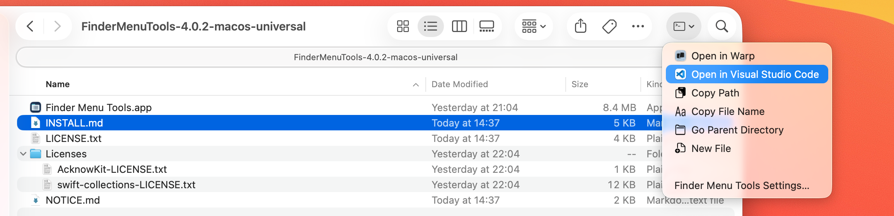
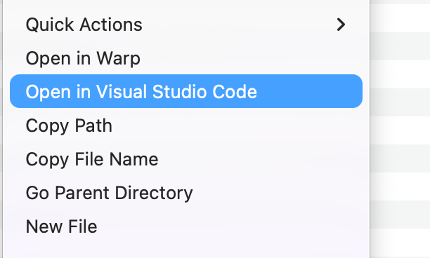
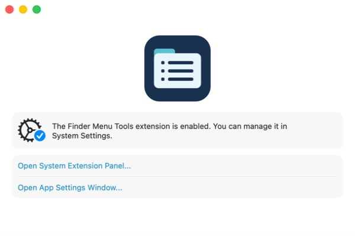
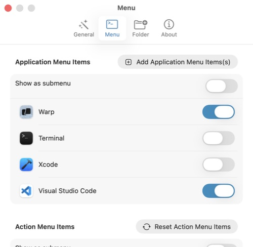
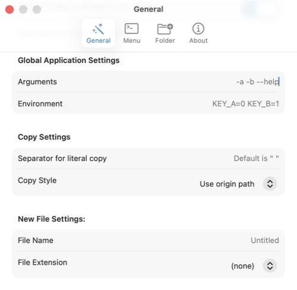

# Finder Menu Tools

Fork repository: [github.com/byrondelgado/MacMenuHelper](https://github.com/byrondelgado/MacMenuHelper)

**Finder Menu Tools** is an unofficial maintenance fork of
[MenuHelper](https://github.com/Kyle-Ye/MenuHelper), the Finder extension created
by [Kyle-Ye](https://github.com/Kyle-Ye). The original extension, its design and
its core functionality are Kyle-Ye's work. This repository exists to fix a few
small usability and reliability issues and provide a convenient download for
people who want those fixes.

The fork is maintained by [Byron Delgado](https://github.com/byrondelgado).
It is independent of, and is not endorsed by, the original author. The GitHub
repository retains the name `MacMenuHelper`; the downloadable app has its own
name and icon. Please direct issues with this fork to
[this repository](https://github.com/byrondelgado/MacMenuHelper/issues).

## A quick look

**Your tools, right inside Finder.** Open files and folders in Warp or Visual
Studio Code, copy paths, create files and open Settings from the toolbar menu.

<p align="center">
  <a href="docs/screenshots/finder-toolbar-menu.png"></a>
</p>

<table>
  <tr>
    <td width="50%" valign="top">
      <strong>Right-click for quick access</strong>
      <p>Use your enabled commands from a file or folder's context menu.</p>
      <a href="docs/screenshots/finder-context-menu.png"></a>
    </td>
    <td width="50%" valign="top">
      <strong>Ready in Finder</strong>
      <p>Check that the extension is enabled and jump straight to its settings.</p>
      <a href="docs/screenshots/welcome.jpg"></a>
    </td>
  </tr>
  <tr>
    <td width="50%" valign="top">
      <strong>Choose your apps</strong>
      <p>Enable each app independently to choose which commands appear in Finder.</p>
      <a href="docs/screenshots/application-settings.jpg"></a>
    </td>
    <td width="50%" valign="top">
      <strong>Set up everyday file actions</strong>
      <p>Choose how paths are copied and set defaults for new files.</p>
      <a href="docs/screenshots/copy-and-file-settings.jpg"></a>
    </td>
  </tr>
</table>

Click any screenshot to view it at full size.

Screenshots show version 4.0.2 on macOS 26. No personal files, account details
or home-directory paths are shown.

## What this fork changes

- Open Settings directly from the Finder menu.
- Visible buttons to remove individual entries from both folder lists.
- Clear on/off switches for individual application menu entries.
- Menu changes reach Finder without restarting it, without a refresh loop.
- Application entries are loaded before Finder's first menu request.
- Folder permission controls are available again in Settings.
- Warp and Visual Studio Code are detected when installed, and Copy Path works
  with files and folders. The default copy style preserves the literal path.
- A universal, ad hoc signed download for Apple silicon and Intel Macs.

The intention is a small maintenance fork, not a claim to have created the
original extension or an official successor to it.

## Download and install

**Requires macOS 15 or later.** You do not need Xcode, an Apple Developer account
or a subscription to install the prebuilt app.

1. Open [the latest release](https://github.com/byrondelgado/MacMenuHelper/releases/latest)
   and download the **`FinderMenuTools-…-macos-universal.zip`** asset. GitHub's
   automatically generated **Source code** archives do not contain the built app.
2. Extract the ZIP and move **Finder Menu Tools.app** to **Applications**. If the
   App Store edition of MenuHelper or an earlier MacMenuHelper build is installed,
   quit and remove that app first to avoid duplicate Finder extensions.
3. Open **Finder Menu Tools**. This free release is **not notarised by Apple**. If
   macOS blocks it because the developer cannot be verified, open **System
   Settings → Privacy & Security → Open Anyway** for this app, then confirm that
   you want to open it. Managed Macs may prohibit this override. See
   [Apple's instructions](https://support.apple.com/en-us/102445).
4. Click **Open System Extension Panel…** and enable **Finder Menu Tools Extension**.
   On macOS 26, this opens **General → Login Items & Extensions → File Providers**.
5. Open **Settings → Folder → User Selected Directories → Add Folders**. Select
   your home folder (`~/`) or only the folders where you want the extension to
   operate, and click **Open** in the folder picker.
6. In **Settings → Menu**, enable the apps and actions you want, such as **Warp**,
   **Visual Studio Code** and **Copy Path**. Right-click a file, folder or the
   background of a Finder window to use the commands. Choose **Finder Menu Tools
   Settings…** in that menu whenever you want to change the configuration.

**User Selected Directories** grants folder access. **Finder Sync Directories**
controls where the menu appears; adding a folder there alone does not grant
permission. Use the minus-circle button to remove one entry from either list.
Turning an app's switch off hides its command while keeping its configuration.

For updates, checksum verification and troubleshooting, see
[the installation guide](docs/INSTALL.md). Each user grants their own permissions;
the release contains no maintainer-specific settings or folder bookmarks.

## Credit and licence

Original project: **[MenuHelper by Kyle-Ye](https://github.com/Kyle-Ye/MenuHelper)**.
The upstream notice **Copyright 2023-2024 Kyle-Ye** and the original source-file
copyright notices are preserved. Upstream credits
[SwiftyMenu by Lex Tang](https://github.com/lexrus/SwiftyMenu) as inspiration.

This fork retains the original **Functional Source License 1.1 with MIT Future
License (FSL-1.1-MIT)** in [LICENSE.txt](LICENSE.txt). Our modifications are offered
under those same terms. We distribute this maintenance fork without charge as a
non-commercial project. That does not remove the licence's restrictions on
competing commercial products or services, or grant rights to upstream trademarks
or branding. Upstream names are used here to identify the original work and its
author, without implying endorsement.

The licence permits modification and redistribution for its permitted purposes,
provided its conditions and copyright notices are retained. The MIT future grant
applies on each version's second anniversary; this is **not** a blanket claim
that the whole current fork is already MIT-licensed. Read
[the licensing review](docs/LICENSING.md) and the actual licence before changing
how the software is distributed or commercialised.

The app and ZIP include the original licence, [NOTICE.md](NOTICE.md), and the
[dependency licences](Licenses/). Dependencies are AcknowKit by Kyle-Ye (MIT) and
Swift Collections by Apple and its contributors (Apache 2.0 with Swift's Runtime
Library Exception).

## Build from source

Install and select Xcode, then run:

```sh
./scripts/build-local.sh
```

For a universal build with the complete release ZIP and SHA-256 checksum:

```sh
./scripts/package-release.sh
```

The app is built under `~/Library/Caches/MacMenuHelper/DerivedData/Build/Products/Release/`;
the release files are written to `dist/`. No signing certificate is needed for
this ad hoc build. Both app and extension remain sandboxed, and their
shared-preference exception is limited to the fork's own settings domain.

The Xcode target names and bundle identifiers retain their earlier technical
names so existing fork settings continue to work. They do not identify this as
an upstream release. Build and packaging details are in
[the release guide](docs/RELEASING.md), with [validation coverage](docs/VALIDATION.md).

## Security

Use the latest release. Version 4.0.2 hardens file creation, shell-copy formatting,
logging, permission lifetime and menu dispatch. New File will fail if the name
already exists, rather than replacing data. Shell copy formats separate multiple
items with spaces; the custom separator applies only to literal copy.

See [the security policy](SECURITY.md) and [the review and regression coverage](docs/SECURITY-REVIEW.md).
Run `./scripts/test-security.sh` to exercise the production safety helpers. The
review does not guarantee that all vulnerabilities have been eliminated; the
free distribution remains ad hoc signed and unnotarised.
